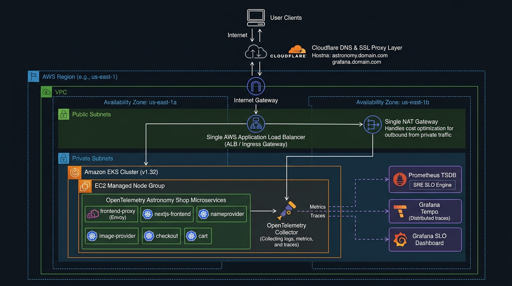

# 🛒 Instana Robot Shop — AWS Cloud Platform (EKS & ELK Stack)



Bu proje; çok katmanlı, çok dilli (polyglot) mikroservis mimarisine ve çeşitli veritabanlarına (MongoDB, MySQL, Redis, RabbitMQ) sahip **Instana Robot Shop** e-ticaret platformunun AWS bulut ortamında üretim standartlarında ayağa kaldırılmasını sağlar. 

Altyapı; **Terraform Modülleri** ile sıfır hata prensibiyle provizyon edilir, **DynamoDB gerektirmeyen saf S3 State Backend** kullanır, kurumsal AWS kota ve maliyet optimizasyonlarına tam uyum sağlar ve kümedeki tüm konteyner loglarını **Fluent Bit (CRI Parser)** ile toplayıp **Merkezi ELK Stack (Elasticsearch 8.15 & Kibana 8.15)** üzerinde indeksler.

---

## 📑 Hızlı Bağlantılar
* 📖 **[Master Kurulum ve Operasyon Kılavuzu (A'dan Z'ye)](docs/FULL_SETUP_AND_OPERATIONS_GUIDE.md)**: Sunucu, AWS CLI, Terraform, Helm ve ELK derinlemesine kurulum rehberi.
* 🧪 **[Merkezi Log Analizi & Kök Neden Laboratuvarı](docs/LOG_ANALYSIS_LAB.md)**: Kibana KQL sorguları, arıza simülasyonları ve RCA alıştırmaları.

---

## 🏛️ Uygulama Mimarisi ve Bileşenler

Altyapı; AWS üzerinde çift Kullanılabilirlik Alanında (Multi-AZ) konuşlanan VPC, genel ve özel alt ağlar, tekil NAT Gateway (maliyet optimizasyonu), Kubernetes v1.31 EKS Kümesi ve EC2 Managed Node Group bileşenlerinden oluşur.


### Mimari Katmanlar ve Bileşenler:
1. **Giriş & Yönlendirme:** İsteğe bağlı Cloudflare DNS & SSL proxy katmanı ve AWS Multi-AZ genel alt ağlarındaki tekil Ingress Gateway (ALB).
2. **Uygulama & Mikroservis Katmanı:** EKS Özel Alt Ağlarında koşan polyglot mikroservisler (web AngularJS/Nginx, catalogue, cart, user, payment, shipping, dispatch, ratings).
3. **Veri Katmanı:** Kümeye özel izole veritabanları (MongoDB, Redis, MySQL, RabbitMQ).
4. **Merkezi Loglama & Observability (ELK):** Fluent Bit (CRI Parser DaemonSet), Elasticsearch 8.15 TSDB ve Kibana 8.15 Dashboard.

### 🧩 Mikroservis Ekosistemi Özeti:
| Mikroservis | Teknoloji / Dil | Veritabanı / Bağımlılık | Görevi |
| :--- | :--- | :--- | :--- |
| **web** | Nginx & AngularJS | Tüm servisler | Ana vitrin, statik içerik ve reverse proxy. |
| **catalogue** | Node.js | MongoDB | Ürün listeleme, arama ve detay sunumu. |
| **user** | Node.js | MongoDB | Kullanıcı kaydı, giriş ve oturum yönetimi. |
| **cart** | Node.js | Redis | Alışveriş sepeti ve anlık ürün miktarları. |
| **payment** | Python (Flask) | dispatch | Güvenli ödeme onaylama ve fatura kesme. |
| **shipping** | Java (Spring Boot) | MySQL | Kargo ücreti hesaplama ve şehir rotaları. |
| **dispatch** | Golang | RabbitMQ | Sipariş sonrası sevkiyat kuyruğu işleme. |
| **ratings** | PHP | - | Ürün yıldız puanları ve değerlendirmeleri. |
| **load-gen** | Python (Locust) | web | Sürekli gerçekçi müşteri trafiği üreten robot. |

---

## 🛠️ Modüler Terraform Mimarisi

Altyapı, kod tekrarını önleyen ve farklı ortamlara (`dev`, `staging`, `prod`) tek parametreyle dağıtım sağlayan modüler bir yapıdadır:

```text
terraform/
├── backend.tf                  # Pure S3 Backend (DynamoDB'ye ihtiyaç duymaz)
├── main.tf                     # Modülleri birleştiren ana orkestrasyon
├── variables.tf                # Giriş değişkenleri ve varsayılanlar
├── outputs.tf                  # Küme adı, endpoint ve kubeconfig komutları
├── environments/
│   ├── dev.tfvars              # Dev Ortamı (us-east-1, 2x t3.medium, 10.10.0.0/16)
│   ├── staging.tfvars          # Test Ortamı (us-east-1, 2x t3.medium, 10.20.0.0/16)
│   └── prod.tfvars             # Üretim Ortamı (us-east-1, 3x t3.medium, 10.30.0.0/16)
└── modules/
    ├── vpc/                    # Multi-AZ VPC, Genel/Özel Subnetler, Tek NAT Gateway
    ├── eks/                    # Standart AWS EKS v1.31 & Managed Node Group
    ├── ecr/                    # 8 mikroservis için otomatik ECR depoları
    └── ecs/                    # Opsiyonel AWS ECS Fargate modülü
```

---

## 🚀 Adım Adım Kurulum Kılavuzu

### 1. Yöntem: GitHub Actions ile Tek Tıkla Dağıtım (Önerilen)

1. Deponuzun **Settings -> Secrets and variables -> Actions** bölümüne gidin ve şu secret'ları ekleyin:
   - `AWS_ACCESS_KEY_ID`
   - `AWS_SECRET_ACCESS_KEY`
   - *(Opsiyonel)* `AWS_SESSION_TOKEN` (Geçici STS token kullanılıyorsa)
   - *(Opsiyonel)* `AWS_REGION` (Varsayılan: `us-east-1`)
2. **Actions** sekmesine gidin ve **"Terraform AWS EKS & ELK Platform CI/CD"** iş akışını seçin.
3. **Run workflow** butonuna tıklayın:
   - **Target AWS Environment:** `dev`
   - **Terraform Execution Action:** `apply`
   - **Deploy Robot Shop (Helm):** `true`
   - **Deploy ELK Stack:** `true`
4. İş akışı; S3 state bucket'ını otomatik oluşturur, EKS kümesini ayağa kaldırır, Helm ile Robot Shop'u ve ELK loglama katmanını deploy eder!

---

### 2. Yöntem: CLI ile Adım Adım Manuel Dağıtım

#### Adım 2.1: Kimlik Bilgilerini Tanımlama
```bash
export AWS_ACCESS_KEY_ID="AKIA..."
export AWS_SECRET_ACCESS_KEY="..."
export AWS_DEFAULT_REGION="us-east-1"
```

#### Adım 2.2: Terraform ile EKS Altyapısını Kurma
```bash
cd terraform

# 1. Terraform sağlayıcılarını ve S3 backend'i başlatın
# (Kendi bucket adınızı veya otomatik bucket oluşturmayı kullanabilirsiniz)
terraform init \
  -backend-config="bucket=robotshop-tfstate-myaccount-dev" \
  -backend-config="key=environments/dev/terraform.tfstate" \
  -backend-config="region=us-east-1"

# 2. Planı inceleyin ve onaylayın
terraform apply -auto-approve -var-file="environments/dev.tfvars"

# 3. Kubeconfig bağlantısını EKS'e yönlendirin
aws eks --region us-east-1 update-kubeconfig --name robotshop
kubectl get nodes
```

#### Adım 2.3: Instana Robot Shop Uygulamasını Dağıtma (Helm)
```bash
helm upgrade --install robot-shop ../K8s/helm/ \
  --namespace robot-shop \
  --create-namespace \
  --wait --timeout 10m

# Yük üreticiyi (Locust) ayağa kaldırın
kubectl apply -f ../K8s/load-deployment.yaml -n robot-shop

# Pod durumlarını inceleyin
kubectl -n robot-shop get pods
```

#### Adım 2.4: Merkezi ELK Stack'i Kurma
```bash
# Elasticsearch 8.15, Kibana 8.15 ve Fluent Bit (CRI Parser) kurulumu
kubectl apply -f ../elk-stack/

# Podların hazır olmasını bekleyin
kubectl -n logging rollout status statefulset/elasticsearch --timeout=5m
kubectl -n logging rollout status deployment/kibana --timeout=5m
kubectl -n logging get pods
```

---

## 🔍 Merkezi Log Analizi & Arıza Simülasyonu

Uygulamanın çalıştığını ve logların Elasticsearch'e aktığını doğrulamak için:

1. **Kibana'ya Bağlanın:**
   ```bash
   kubectl port-forward svc/kibana 5601:5601 -n logging
   ```
   Tarayıcınızda açın: `http://localhost:5601` -> **Management -> Index Patterns** -> `k8s-logs-*` oluşturun.

2. **Kasıtlı Hata Senaryosu Tetikleyin:**
   ```bash
   ./scripts/simulate-log-incidents.sh all
   ```
   Bu komut MongoDB'yi geçici olarak durdurur, hatalı ödeme istekleri yollar ve MySQL sorgu hataları üretir.

3. **Kibana'da KQL ile Hataları Yakalayın:**
   ```text
   kubernetes.namespace_name: "robot-shop" AND (log: "*Error*" OR log: "*timeout*" OR log: "*500*")
   ```

---

## 🧹 Temizlik & Maliyet Tasarrufu (Teardown)

Test veya eğitim ortamı tamamlandığında faturanın şişmemesi ve tüm AWS kaynaklarını temizlemek için:

```bash
# CLI ile:
./scripts/destroy-aws-infra.sh dev

# veya GitHub Actions üzerinden:
# action: destroy seçeneğiyle Run workflow çalıştırın.
```
