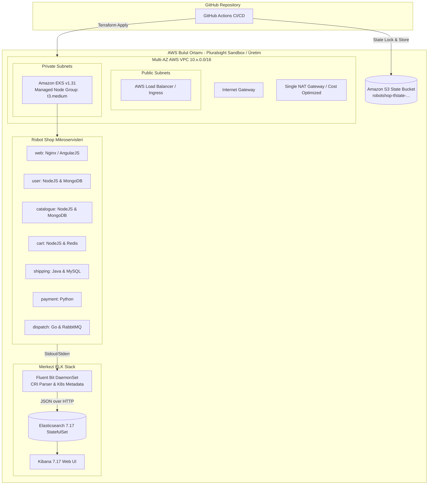

# 📘 Instana Robot Shop AWS Cloud Platform (EKS & ELK) — Master Kurulum ve Operasyon Kılavuzu

Bu kılavuz; **Instana Robot Shop** çok katmanlı e-ticaret platformunun **AWS EKS** üzerinde **Terraform Modülleri**, **S3 State Backend** (DynamoDB gerektirmeyen) ve **Merkezi ELK Stack (Elasticsearch, Kibana, Fluent Bit)** ile A'dan Z'ye kurulumunu, yönetimini ve operasyonel detaylarını kapsar.

---

## 📑 İçindekiler
1. [Genel Mimari & Teknoloji Yığını](#1-genel-mimari--teknoloji-yığını)
2. [Pluralsight AWS Sandbox & Hesap Uyumluluğu](#2-pluralsight-aws-sandbox--hesap-uyumluluğu)
3. [Terraform Modüler Yapısı & Çoklu Ortam Yönetimi](#3-terraform-modüler-yapısı--çoklu-ortam-yönetimi)
4. [S3 State Backend Mimarisi (DynamoDB'siz)](#4-s3-state-backend-mimarisi-dynamodbsiz)
5. [GitHub Actions CI/CD ile Otomatik Dağıtım](#5-github-actions-cicd-ile-otomatik-dağıtım)
6. [CLI ile Manuel Kurulum Adımları](#6-cli-ile-manuel-kurulum-adımları)
7. [Instana Robot Shop Mikroservisleri & Helm Dağıtımı](#7-instana-robot-shop-mikroservisleri--helm-dağıtımı)
8. [Merkezi Loglama: ELK Stack & Fluent Bit CRI Konfigürasyonu](#8-merkezi-loglama-elk-stack--fluent-bit-cri-konfigürasyonu)
9. [Laboratuvar Alıştırması: Arıza Simülasyonu & Kök Neden Analizi](#9-laboratuvar-alıştırması-arıza-simülasyonu--kök-neden-analizi)
10. [Maliyet Optimizasyonu & Küme Temizliği (Teardown)](#10-maliyet-optimizasyonu--küme-temizliği-teardown)

---

## 🏛️ 1. Genel Mimari & Teknoloji Yığını



---

## ☁️ 2. Pluralsight AWS Sandbox & Hesap Uyumluluğu

Pluralsight Cloud Playground / AWS Sandbox ortamlarının kendine özgü kotaları ve güvenlik sınırları bulunur:
* **Bölge (Region):** Pluralsight sandbox'ları varsayılan olarak `us-east-1` (N. Virginia) bölgesini kullanır. Projemizdeki tüm şablonlar ve tfvars dosyaları `us-east-1` ile tam uyumludur.
* **EC2 & Node Boyutu:** Sandbox'lar genellikle `t3.medium` veya `t3.small` örneklerine izin verir. Robot Shop'un 10 mikroservisi ve veritabanları için **2 adet `t3.medium`** seçilmiştir.
* **NAT Gateway Maliyet Optimizasyonu:** AWS'te her AZ için ayrı NAT Gateway açmak yerine, `modules/vpc` içinde tek bir ortak NAT Gateway oluşturulur. Bu sayede sandbox EIP ve maliyet sınırları aşılmaz.
* **IAM Rolleri:** EKS kümesi ve node'ları için resmi AWS politikaları (`AmazonEKSClusterPolicy`, `AmazonEKSWorkerNodePolicy`, `AmazonEKS_CNI_Policy`, `AmazonEC2ContainerRegistryReadOnly`) kullanılır.

---

## 📦 3. Terraform Modüler Yapısı & Çoklu Ortam Yönetimi

Altyapı tamamen modüler olarak tasarlanmıştır:
```text
terraform/
├── backend.tf                  # Pure S3 Backend (DynamoDB gerektirmez)
├── main.tf                     # Modülleri çağıran ana orkestrasyon dosyası
├── variables.tf                # Genel değişkenler (Region, env, instance type vb.)
├── outputs.tf                  # Küme adı, endpoint, vpc_id ve kubeconfig komutları
├── environments/
│   ├── dev.tfvars              # Geliştirme ortamı (2x t3.medium, us-east-1)
│   ├── staging.tfvars          # Test ortamı
│   └── prod.tfvars             # Üretim ortamı (3x t3.medium)
└── modules/
    ├── vpc/                    # Multi-AZ VPC, Public/Private Subnetler, NAT GW
    ├── eks/                    # EKS Cluster Control Plane & Managed Node Group
    ├── ecr/                    # 8 mikroservis için güvenli ECR depoları
    └── ecs/                    # Alternatif / Hibrit ECS Fargate modülü
```

Ortam seçimi `-var-file` parametresi ile yapılır:
```bash
terraform plan -var-file="environments/dev.tfvars"
terraform apply -var-file="environments/prod.tfvars"
```

---

## 🔒 4. S3 State Backend Mimarisi (DynamoDB'siz)

Kullanıcının özel isteği doğrultusunda **DynamoDB tablo gereksinimi tamamen kaldırılmıştır**.
Modern Terraform (v1.6+) ve AWS S3, yerel durum kilitlemesini ve sürümlemeyi (versioning) doğrudan S3 nesne düzeyinde destekler.

`backend.tf`:
```terraform
terraform {
  backend "s3" {
    # Parametreler terraform init sırasında dinamik olarak geçilir:
    #   -backend-config="bucket=${BUCKET_NAME}"
    #   -backend-config="key=environments/${ENV}/terraform.tfstate"
    #   -backend-config="region=${AWS_REGION}"
  }
}
```

---

## 🚀 5. GitHub Actions CI/CD ile Otomatik Dağıtım

GitHub Secrets bölümüne eklediğiniz `AWS_ACCESS_KEY_ID` ve `AWS_SECRET_ACCESS_KEY` kullanılarak **tek tıkla** dağıtım yapılabilir.

### GitHub Actions Üzerinden Dağıtım Adımları:
1. GitHub reponuzda **Actions** sekmesine gidin.
2. Sol menüden **"Terraform AWS EKS & ELK Platform CI/CD"** iş akışını seçin.
3. **Run workflow** butonuna tıklayın:
   - **Target AWS Environment:** `dev`, `staging` veya `prod` seçin.
   - **Terraform Execution Action:**
     - `plan`: Değişiklikleri önceden denetler.
     - `apply`: Altyapıyı kurar, Robot Shop'u Helm ile yükler ve ELK Stack'i ayağa kaldırır.
     - `destroy`: Kaynakları güvenli şekilde siler.
   - **Deploy Robot Shop Microservices:** `true`
   - **Deploy Centralized ELK Stack:** `true`
4. Boru hattı S3 bucket'ını otomatik oluşturur, Terraform'u çalıştırır ve uygulamanızı EKS'e deploy eder!

---

## 💻 6. CLI ile Manuel Kurulum Adımları

Eğer yerel terminalden veya GCP/Linux sunucusundan çalıştırmak isterseniz:

```bash
# 1. AWS Kimlik Bilgilerini Tanımlayın
export AWS_ACCESS_KEY_ID="AKIA..."
export AWS_SECRET_ACCESS_KEY="..."
export AWS_REGION="us-east-1"

# 2. Altyapıyı Tek Komutla Kurun
cd ecommerce-aws-elk-platform
./scripts/deploy-aws-infra.sh dev

# 3. Instana Robot Shop Mikroservislerini Dağıtın
./scripts/deploy-robot-shop.sh

# 4. Merkezi ELK Stack'i (Elasticsearch, Kibana, Fluent Bit) Kurun
./scripts/deploy-elk.sh
```

---

## 🛍️ 7. Instana Robot Shop Mikroservisleri & Helm Dağıtımı

Robot Shop, modern e-ticaret senaryolarını test etmek için 10 farklı bileşenden oluşur:
* **web:** AngularJS & Nginx web arayüzü.
* **catalogue:** Node.js tabanlı ürün kataloğu (MongoDB).
* **user:** Kullanıcı kayıt ve giriş servisi (MongoDB).
* **cart:** Sepet servisi (Redis).
* **shipping:** Kargo hesaplama ve sipariş servisi (Java Spring & MySQL).
* **payment:** Ödeme servisi (Python).
* **dispatch:** Sevkiyat mesaj kuyruğu (Golang & RabbitMQ).
* **ratings:** Kullanıcı ürün değerlendirme servisi (PHP).
* **load-gen:** Arka planda gerçek kullanıcı gibi gezinip sepete ürün ekleyen Locust yük üretici.

Helm ile dağıtım:
```bash
helm upgrade --install robot-shop ./K8s/helm/ --namespace robot-shop --create-namespace
```

---

## 📊 8. Merkezi Loglama: ELK Stack & Fluent Bit CRI Konfigürasyonu

Kubernetes v1.31 ve modern EKS düğümleri **containerd (CRI)** kullanır. Fluent Bit konfigürasyonumuz hem Docker JSON loglarını hem de containerd CRI loglarını otomatik parse edecek şekilde yapılandırılmıştır:

1. **Fluent Bit DaemonSet:** Her EKS düğümündeki `/var/log/containers/*.log` dosyasını dinler.
2. **Kubernetes Filtresi:** Pod adı, namespace, container adı ve host etiketlerini loga ekler.
3. **Elasticsearch (7.17):** `k8s-logs-*` indeksi altında logları zaman damgasıyla saklar.
4. **Kibana:** Port 5601 üzerinden web arayüzü sunar.

Kibana arayüzüne erişim:
```bash
kubectl port-forward svc/kibana 5601:5601 -n logging
# Tarayıcıdan: http://localhost:5601
```

---

## 🔬 9. Laboratuvar Alıştırması: Arıza Simülasyonu & Kök Neden Analizi

Öğrencilerin Kibana üzerinde hata ayıklama yeteneğini geliştirmek için arıza simülasyon betiği hazırlanmıştır:

```bash
# Arıza simülasyonunu çalıştırın
./scripts/simulate-log-incidents.sh all
```

Bu betik:
1. **MongoDB çökmesi:** `catalogue` podlarının bağlantı zaman aşımı (timeout) logları üretmesini sağlar.
2. **Hatalı Ödeme:** `payment` servisinde geçersiz para birimi ve negatif tutar ile HTTP 500 hataları tetikler.
3. **MySQL Hatası:** `shipping` servisinde geçersiz şehir ID'si sorgulatarak SQL hata logları oluşturur.

### Kibana'da Log Arama (KQL):
Kibana -> **Discover** ekranında Index Pattern olarak `k8s-logs-*` oluşturduktan sonra şu filtreleri deneyin:
* Namespace bazında hatalar:
  ```text
  kubernetes.namespace_name: "robot-shop" AND (log: "*Error*" OR log: "*Exception*" OR log: "*timeout*")
  ```
* Sadece Payment servisi logları:
  ```text
  kubernetes.container_name: "payment"
  ```
* MongoDB bağlantı kopmaları:
  ```text
  kubernetes.container_name: "catalogue" AND log: "*MongoServerSelectionError*"
  ```

---

## 🧹 10. Maliyet Optimizasyonu & Küme Temizliği (Teardown)

Eğitim veya deneme bittiğinde faturanın şişmemesi veya Pluralsight sandbox süresinin dolmaması için tek komutla temizlik yapılır:

### GitHub Actions ile Temizlik:
İş akışında `action: destroy` seçilerek çalıştırılır.

### CLI ile Temizlik:
```bash
./scripts/destroy-aws-infra.sh dev
```
Bu betik önce Kubernetes üzerindeki Load Balancer ve Ingress kaynaklarını kaldırır, ardından Terraform ile EKS, NAT Gateway ve VPC bileşenlerini eksiksiz temizler.
